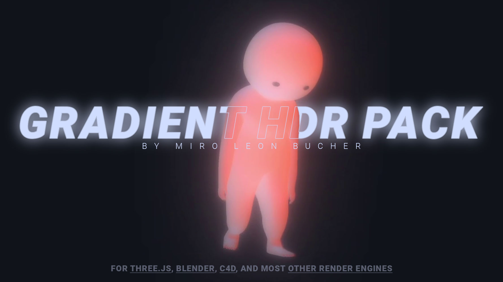

# Gradient HDR Pack Freebie

Welcome to the **Gradient HDR Freebie Pack**! This repository provides a glimpse into the full [Gradient HDR Pack](https://miroleon.gumroad.com/l/gradient_hdr_pack) available on Gumroad. Here, you'll find two selected HDRs used in my own artworks, perfect for stylised renderings.

## About The HDRs

The .hdr files in this pack are in varying resolutions and are compatible with a wide range of 3D applications. They're especially effective when used with reflective, chrome-like materials.

## Usage

Interested in effectively using these HDRs in your Three.js projects? I've put together a step-by-step [YouTube tutorial](https://youtu.be/Muq-VpaPzoE) and provided a [Codepen template code](https://codepen.io/miroleon/pen/dyQdzKq) for you to start with.

## Full Version

Enjoyed using these HDRs? Check out the full [Gradient HDR Pack](https://miroleon.gumroad.com/l/gradient_hdr_pack) on Gumroad, which includes 27 unique HDRs. The full pack is available for a minimum price of €5, with an option to pay more if you wish to offer extra support.

## Connect

Stay updated on new releases by following me on social media and subscribing to my mailing list:

- [YouTube](https://youtube.com/@miroxleon)
- [Instagram](https://www.instagram.com/miroxleon/)
- [Twitter](https://twitter.com/miroxleon)
- [Mailing List](https://miroleon.de/newsletter)

Thank you for your support, and enjoy creating!
